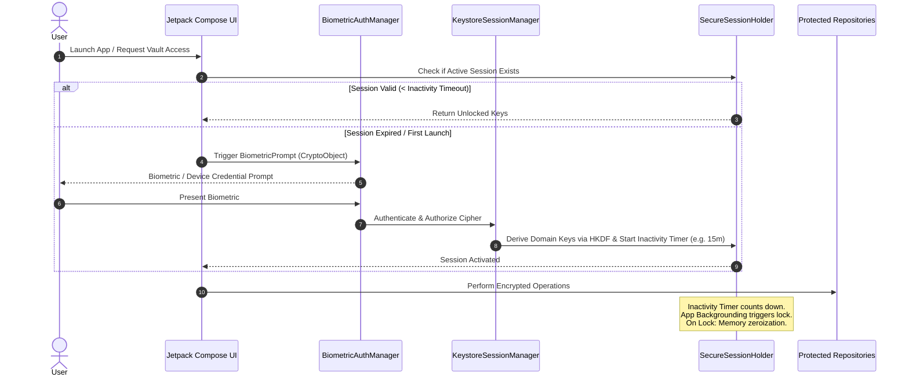

# PIMS Architecture & Security Audit (Milestone B Codebase)
## Comprehensive Vulnerability Analysis, Threat Model & Option C Design Specification

---

## 1. Executive Codebase Audit (Milestone B Findings)

We conducted a line-by-line audit across all created files (`CryptoEngine.kt`, `StandardCryptoEngine.kt`, `EncryptedFileStorageImpl.kt`, `ProfileEntities.kt`, `DomainEntities.kt`, `ProfileDaos.kt`, `DomainDaos.kt`, `RepositoriesImpl.kt`, and `RoomConverters.kt`).

Below are the identified security flaws, cryptographic risks, and architectural issues, along with exact remediations.

---

### Finding 1: Java AES-GCM Tag Segmentation Mismatch (Cryptographic Inconsistency)
* **Location:** `StandardCryptoEngine.kt` vs `VaultRepositoryImpl.kt` vs `VaultItemEntity`
* **Issue:** In Java/Android standard JCE (`Cipher.getInstance("AES/GCM/NoPadding")`), `cipher.doFinal()` automatically appends the 16-byte (128-bit) authentication tag to the end of the ciphertext byte array (`cipherBytes = ciphertext || authTag`). 
  However, `VaultItemEntity` defined both `encryptedPayload: ByteArray` AND `authTag: String?`. In `VaultRepositoryImpl`, `encrypted.tag` was null because standard JCE does not return a separate tag object, causing confusion in storage representation.
* **Remediation:** Standardize on the industry standard **Combined Ciphertext Format**:
  $$\text{Payload} = \text{IV (12 bytes)} \mathbin{\Vert} \text{Ciphertext} \mathbin{\Vert} \text{GCM Tag (16 bytes)}$$
  or explicit `EncryptedPayload(val ciphertextWithTag: ByteArray, val iv: ByteArray)`. Remove redundant `auth_tag` database columns.

---

### Finding 2: In-Memory File Buffering & DoS / Memory Leak on Large Documents
* **Location:** `EncryptedFileStorageImpl.kt:47` (`rawBuffer.toByteArray()`)
* **Issue:** Loading entire files into a `ByteArray` in memory before computing SHA-256 and encrypting means a 50MB PDF or high-resolution document scan will allocate 100MB+ of heap memory, triggering Garbage Collection thrashing or `OutOfMemoryError` on constrained Android devices.
* **Remediation:** Implement **Chunked / Streaming Authenticated Encryption**. Stream the input through a `DigestInputStream` (calculating SHA-256 on the fly) into a `CipherOutputStream` directly to disk, avoiding buffering in RAM.

---

### Finding 3: Path Traversal Vulnerability in File Storage Resolution
* **Location:** `EncryptedFileStorageImpl.kt:77` (`File(context.filesDir.parentFile, relativePath)`)
* **Issue:** Resolving `relativePath` against `context.filesDir.parentFile` without canonical path validation allows potential directory traversal (`../`) if an adversarial or corrupted relative path is queried.
* **Remediation:** Strictly resolve all file paths relative to `File(context.filesDir, "vault_documents")` and verify `targetFile.canonicalPath.startsWith(baseDir.canonicalPath)`.

---

### Finding 4: In-Memory Plaintext Zeroization (Memory Hygiene)
* **Location:** `StandardCryptoEngine.kt`, `VaultRepositoryImpl.kt`
* **Issue:** Passwords, TOTP seeds, and decrypted secrets are handled as immutable `String` or un-wiped `ByteArray`. They remain in JVM heap garbage until collected, making them vulnerable to heap dumps or cold-boot memory extraction.
* **Remediation:** Introduce `ProtectedSecret` / `SecretBytes` wrappers implementing `AutoCloseable` that execute `java.util.Arrays.fill(bytes, 0.toByte())` immediately after use.

---

### Finding 5: Room TypeConverters Crashing on Unknown Enum Values
* **Location:** `RoomConverters.kt` (`enumValueOf<T>(it)`)
* **Issue:** `enumValueOf` throws `IllegalArgumentException` if the database contains a newly added or deprecated enum value. If a user downgrades or syncs with a newer schema version, Room queries will crash the entire application.
* **Remediation:** Replace with `try { enumValueOf<T>(it) } catch (e: Exception) { FallbackEnum }` or null-safe safeValueOf helpers.

---

### Finding 6: Audit Log Integrity & Sequence Monotonicity
* **Location:** `AuditEventEntity.kt`, `AuditDao.kt`, `AuditRepositoryImpl.kt`
* **Issue:** Events currently rely on system clock timestamps and hash chaining. If two events occur within the same millisecond or if the system clock is manipulated, order resolution becomes ambiguous. Furthermore, middle-item deletion cannot be mathematically proven without a strict monotonic sequence number.
* **Remediation:** Add `sequence_number: Long` (strictly incrementing $1, 2, 3, \dots, N$) and enforce that each event binds:
  $$\text{EventHash}_n = \text{HMAC-SHA256}(\text{Seq}_n \mathbin{\Vert} \text{Timestamp}_n \mathbin{\Vert} \text{EventType}_n \mathbin{\Vert} \text{PayloadHash}_n \mathbin{\Vert} \text{EventHash}_{n-1}, K_{\text{audit\_ratchet}})$$

---

## 2. Threat Model & Key Hierarchy (STRIDE Analysis)

### 2.1 Domain-Separated Key Hierarchy

```text
                                Android Keystore / StrongBox
                                             │
                                   [Master Seed / KEK]
                                             │
                              HKDF-SHA256 Extract & Expand
                                             │
      ┌───────────────────┬──────────────────┼───────────────────┬───────────────────┐
      │                   │                  │                   │                   │
  Context:            Context:           Context:            Context:            Context:
"PIMS/db/v1"        "PIMS/files/v1"    "PIMS/vault/v1"     "PIMS/audit/v1"     "PIMS/sharing/v1"
      │                   │                  │                   │                   │
      ▼                   ▼                  ▼                   ▼                   ▼
  Database Key        File Key           Vault Key          Audit Ratchet Key    Ephemeral Session Key
(SQLCipher 256-bit) (AES-GCM-256)      (AES-GCM-256)        (HMAC-SHA256)        (X25519 / ChaCha)
```

### 2.2 Hardware Security Level Detection (`KeySecurityLevel`)

```kotlin
enum class KeySecurityLevel(val levelName: String, val isHardwareBacked: Boolean) {
    STRONGBOX("StrongBox Dedicated Security Chip", true),
    TRUSTED_EXECUTION_ENVIRONMENT("Hardware TEE (ARM TrustZone)", true),
    SOFTWARE_FALLBACK("Software Keystore (Emulated)", false)
}
```

* Detection strategy:
  1. Attempt `KeyGenParameterSpec.Builder.setIsStrongBoxBacked(true)`.
  2. If `StrongBoxUnavailableException` or `ProviderException`, fall back to standard Android Keystore (TEE).
  3. Inspect `KeyInfo.isInsideSecureHardware()` and `KeyInfo.securityLevel` to accurately log and present the security level to the user.

---

## 3. Biometric Session Architecture



---

## 4. Option C Implementation Plan & Deliverables

1. **`KeySecurityManager.kt`:** Hardware detection (`StrongBox` $\to$ `TEE` $\to$ Software) and Keystore key lifecycle management.
2. **`HkdfKeyDerivation.kt`:** RFC 5869 compliant HKDF-SHA256 derivation engine with domain separation contexts (`"PIMS/db/v1"`, `"PIMS/files/v1"`, `"PIMS/vault/v1"`, `"PIMS/audit/v1"`).
3. **`BiometricSessionManager.kt`:** Thread-safe biometric authorization, session state holder, memory zeroization on lock, and lifecycle-aware auto-lock timer.
4. **`HardenedCryptoEngine.kt`:** Keystore-backed AES-GCM-256 with streaming support, combined ciphertext formats, and automatic IV generation.
5. **`HardenedAuditLogger.kt`:** Monotonic sequence-numbered, forward-secure chained HMAC audit log with sequential integrity verification engine.
6. **Remediated Option B Files:** Updating `EncryptedFileStorageImpl.kt`, `ProfileDaos.kt`, `DomainEntities.kt`, and `RoomConverters.kt` with all audit fixes.
