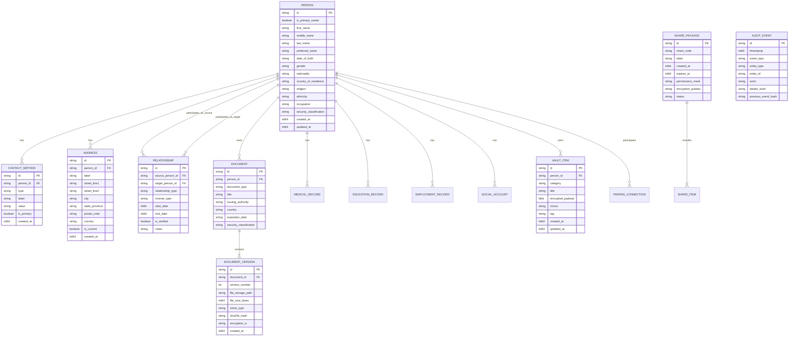
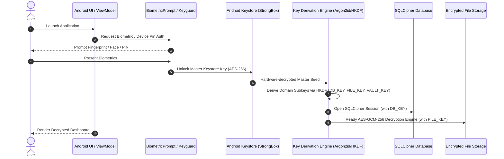
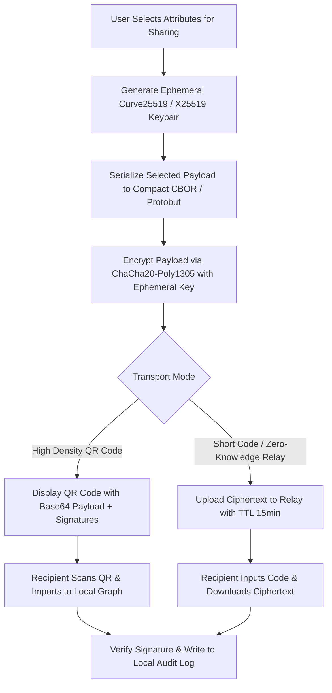

# System Architecture & Technical Specification
## Personal Information Management System (PIMS) & Identity Vault

**Document Version:** 1.0.0  
**Target Platform:** Android 13+ (API 33+)  
**Primary Language & Stack:** Kotlin, Jetpack Compose, Room (SQLCipher / Encrypted SQLite), Android Keystore, Tink / Jetpack Security Crypto, KotlinX Coroutines & Flow, WorkManager, BiometricPrompt.

---

## 1. System Overview & Scope

### 1.1 Executive Summary
The **Personal Information Management System (PIMS)** is a secure, local-first personal identity vault, relationship graph, and selective profile-sharing platform. The system operates under the core privacy paradigm: **"The user owns the data, the device protects the data, and the user explicitly authorizes any boundary crossing."**

### 1.2 Core Security Classifications (Zones)

```mermaid
graph TD
    subgraph Zone 0 & 1: General Profile [Classification: Public / Personal]
        A1[Basic Identity: Name, Occupation]
        A2[General Contact Details: Public Email, Phone]
        A3[Public Online Presence: LinkedIn, Portfolio]
    end

    subgraph Zone 2 & 3: Sensitive Profile [Classification: Private / Sensitive]
        B1[Addresses & Residential History]
        B2[Full Relationship Graph & Kinship]
        B3[Education & Career History]
        B4[Medical Profile: Allergies, Meds, Conditions]
        B5[Document Vault: Passports, National IDs, Degrees]
    end

    subgraph Zone 4: Security Vault [Classification: Critical]
        C1[Account Passwords & Master Pins]
        C2[TOTP 2FA Seeds & Recovery Codes]
        C3[Payment References - Tokenized / Last 4]
        C4[Asymmetric Private Keys & Pairing Secrets]
    end

    style Zone 0 & 1 fill:#e1f5fe,stroke:#0288d1,stroke-width:2px;
    style Zone 2 & 3 fill:#fff3e0,stroke:#f57c00,stroke-width:2px;
    style Zone 4 fill:#ffebee,stroke:#d32f2f,stroke-width:2px;
```

---

## 2. System Requirements

### 2.1 Functional Requirements (FR)

* **FR-01: Multi-Persona & Multi-Entity Management:** Support the primary account owner and related entity profiles (family members, dependents, doctors, colleagues) with configurable depth.
* **FR-02: Flexible Attribute Modeling:** Dynamic support for multiple contact points (phone, email), multi-line internationalized addresses, and occupational timelines.
* **FR-03: Immutable Versioned Document Vault:** Store binary attachments (PDF, JPEG, PNG, WEBP) inside application-private encrypted storage. Support version histories with SHA-256 integrity checks and rolling audit trails.
* **FR-04: Kinship & Relationship Graph:** Model bidirectional and directed interpersonal relationships with verification states, roles, and temporal validity (start/end dates).
* **FR-05: Medical Profile & Emergency Card:** Segregated medical records with the capability to generate an unencrypted or pin-gated lockscreen-accessible Emergency Medical Summary (Blood type, critical allergies, emergency ICE contacts).
* **FR-06: Critical Security Vault:** Dedicated isolated storage for 2FA TOTP secrets (RFC 6238), recovery codes, credentials, and payment references (excluding sensitive CVV/PINs).
* **FR-07: Selective Disclosure & Share Package Engine:** User-curated attribute selection producing encrypted, time-bound ephemeral packages for QR code or short-code transmission.
* **FR-08: Cryptographic Peer Pairing & Sync:** Local-first zero-knowledge device pairing via authenticated key exchange (Noise protocol / ECDH over QR + local WiFi/Bluetooth or zero-knowledge relay).
* **FR-09: Tamper-Evident Audit Logging:** Cryptographically chained event log recording create, read, update, delete, share, and export operations.

### 2.2 Non-Functional Requirements (NFR)

* **NFR-01: Zero-Cloud Dependency (Offline-First):** All CRUD operations, cryptographic handshakes, and UI workflows function without active network connectivity.
* **NFR-02: Cryptographic Rigor:** AES-256-GCM authenticated encryption for files and database payloads; keys rooted in hardware-backed Android Keystore (`StrongBox` where available).
* **NFR-03: Performance:** Cold startup to biometric prompt `< 400ms`; database query execution for typical entity lists `< 25ms`.
* **NFR-04: Resilience & Anti-Tamper:** Immediate memory wiping of sensitive plaintext char arrays / key bytes; automatic UI masking in Android Recents (`FLAG_SECURE`).
* **NFR-05: Configurable Auto-Lock:** Hardware-assisted session revocation on backgrounding (immediate, 30s, 1m, 5m, 15m).

---

## 3. Database Architecture & ER Model

The relational layer is powered by **Room with SQLCipher**. Below is the normalized schema mapping:



---

## 4. Cryptographic Security Architecture



### 4.1 Key Hierarchy & Isolation
1. **Master Key (MK):** Hardware-backed 256-bit AES key generated in Android Keystore with `PURPOSE_ENCRYPT | PURPOSE_DECRYPT`, requiring user authentication per biometric auth timeout window.
2. **Domain Key Derivation (HKDF-SHA256):**
   * `DB_ENCRYPTION_KEY = HKDF-Expand(MK, "pims-sqlite-cipher-v1", 32)`
   * `FILE_ENCRYPTION_KEY = HKDF-Expand(MK, "pims-file-storage-v1", 32)`
   * `VAULT_ENCRYPTION_KEY = HKDF-Expand(MK, "pims-critical-vault-v1", 32)`
3. **Audit Log Hash Chaining:**
   $$\text{Hash}_n = \text{HMAC-SHA256}(\text{EventData}_n \mathbin{\Vert} \text{Hash}_{n-1}, \text{AUDIT\_KEY})$$
   Guarantees tamper evidence and sequential non-repudiation.

---

## 5. Android Clean Architecture Implementation

```text
app/src/main/java/com/pims/vault/
│
├── core/
│   ├── crypto/                 # Keystore, HKDF, Biometric wrappers, AES-GCM
│   ├── database/               # Room Database, Converters, SQLCipher Drivers
│   ├── model/                  # Core domain models & Enums (Classification, Types)
│   └── common/                 # Result wrappers, Dispatcher providers, Extensions
│
├── data/
│   ├── local/
│   │   ├── dao/                # PersonDao, DocumentDao, RelationshipDao, VaultDao
│   │   ├── entity/             # Room Database Entities
│   │   └── storage/            # EncryptedFileStorage (App-private scoped storage)
│   └── repository/             # Concrete implementations of Domain Repositories
│
├── domain/
│   ├── repository/             # Abstract Repository Interfaces
│   └── usecase/
│       ├── profile/            # GetPersonGraphUseCase, SaveProfileUseCase
│       ├── document/           # IngestDocumentVersionUseCase, VerifyIntegrityUseCase
│       ├── sharing/            # CreateSharePackageUseCase, DecryptSharePackageUseCase
│       └── vault/              # ManageVaultItemUseCase, GenerateTotpTokenUseCase
│
└── presentation/
    ├── ui/
    │   ├── theme/              # Material3 Theme, Color Palettes, Typography
    │   ├── navigation/         # Navigation Graph, Routes, Deep links
    │   ├── home/               # Dashboard, Category Cards, Quick Actions
    │   ├── profile/            # Person Details, Contact methods, Address timelines
    │   ├── relationships/      # Visual Kinship Graph, Related Person Linker
    │   ├── documents/          # Document Vault, Version History, File Preview
    │   ├── medical/            # Medical Dossier, Emergency Lockscreen Card Generator
    │   ├── vault/              # Isolated Master-Auth Authenticator & Credentials Vault
    │   └── sharing/            # Selective Sharing Picker, QR Generator & Scanner
    └── viewmodel/              # MVI / MVVM ViewModels with unidirectional state flow
```

---

## 6. Selective Sharing & Ephemeral Exchange Protocol



---

## 7. Immediate Implementation Roadmap

| Phase | Milestone | Deliverables |
| :--- | :--- | :--- |
| **Phase 1** | **Core Foundation & Security** | Gradle build config with Kotlin 2.0+, SQLCipher Room setup, Android Keystore manager, Biometric unlock flow. |
| **Phase 2** | **Domain Entities & Storage** | Room DAOs, Encrypted file manager for document versions, SHA-256 integrity verifier, Audit log system. |
| **Phase 3** | **UI Design System & Core Features** | Material3 Jetpack Compose UI, Dynamic Form builder with placeholder guidance, Profile & Timeline views. |
| **Phase 4** | **Relationship Graph & Medical Dossier** | Kinship linker, Interactive Graph view, Emergency Medical Card (lockscreen/quick-access export). |
| **Phase 5** | **Security Vault (Zone 4)** | Re-auth gated vault screen, TOTP generator (RFC 6238), Tokenized payment cards, Encrypted notes. |
| **Phase 6** | **Selective Sharing & Pairing** | Dynamic field selector, Compact QR code engine (ZXing / CameraX), Offline P2P import & audit confirmation. |
